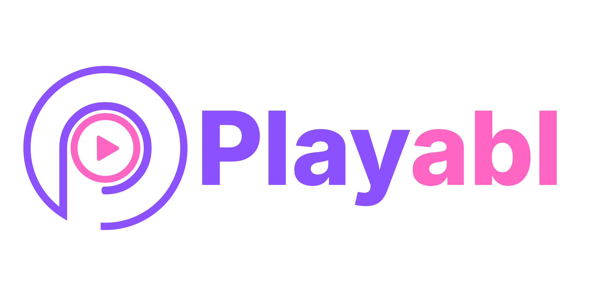
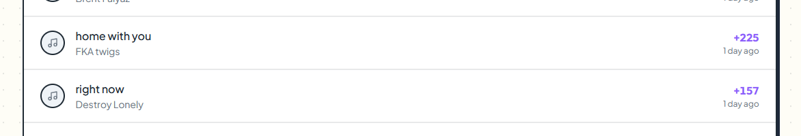
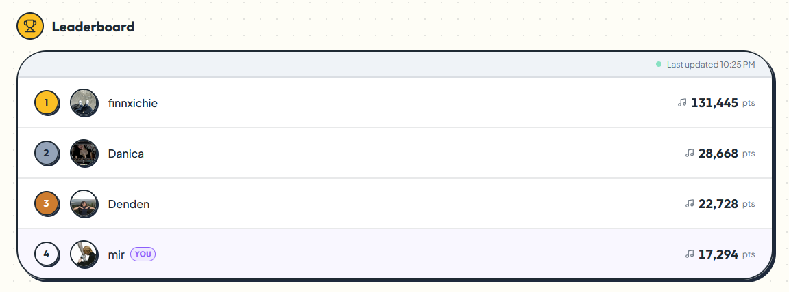
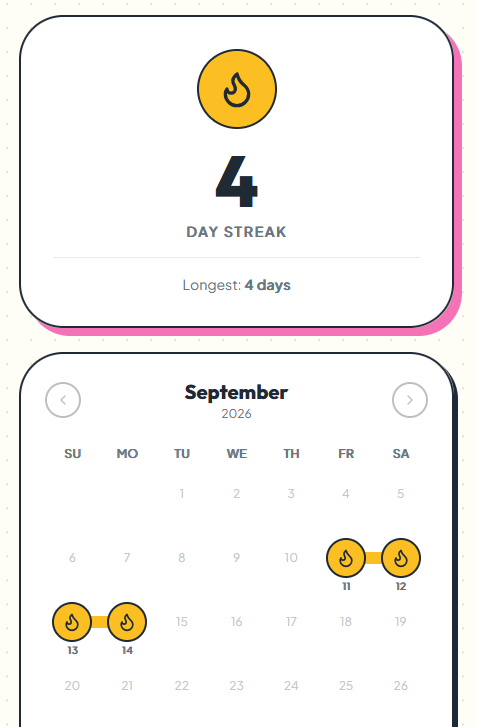
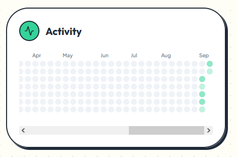
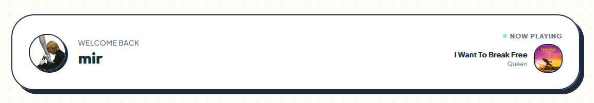

# Playabl

Playabl is a social listening app connected to Spotify. Every second of music you listen to earns you points — compete on the global leaderboard, maintain daily streaks, and share your stats with friends.

## Key Features

### Points
Every second of verified listening earns you a point — tracked server-side via Spotify's recently-played API so there's no cheating.

### Leaderboard
Compete on the global all-time leaderboard, updated every ~3 minutes as listening events roll in.

### Streaks
Keep your daily listening streak alive. Miss a day and it resets — just like Duolingo.

### Activity Heatmap
A GitHub-style heatmap of your listening history. Deeper colour = more listening that day.

### Now Playing
A live widget that shows the track you're currently listening to.

## Stack

Next.js · Supabase (Auth, Postgres, Edge Functions, pg_cron) · Spotify API · Tailwind CSS · shadcn/ui
